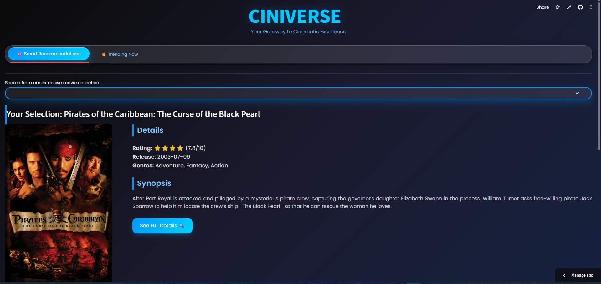
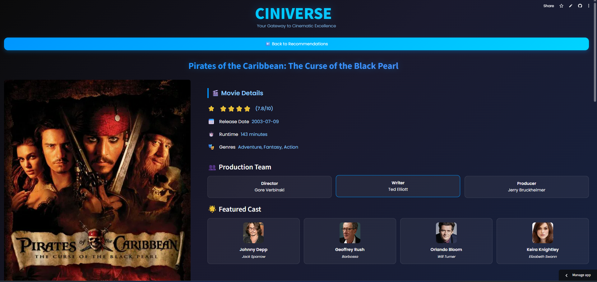
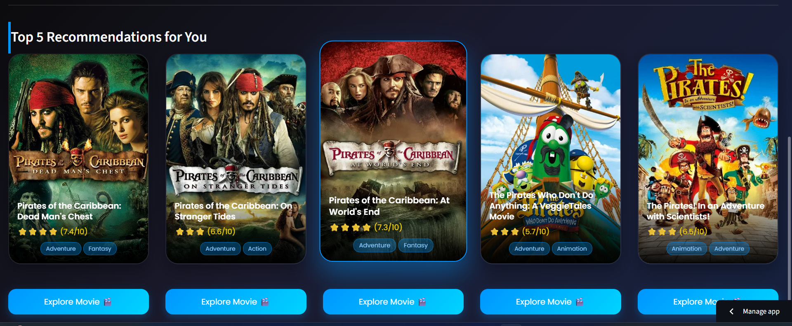
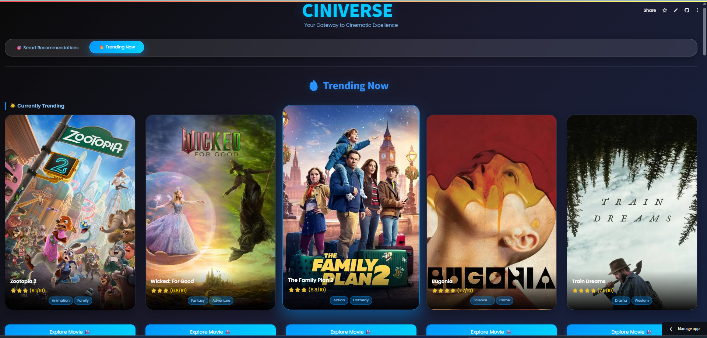
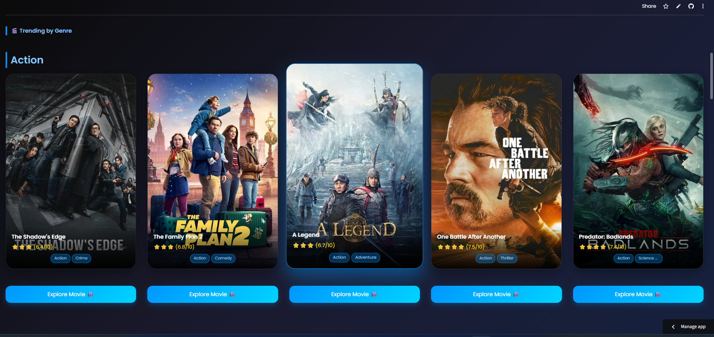
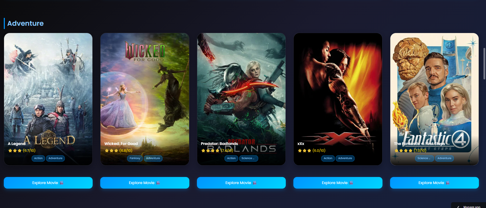
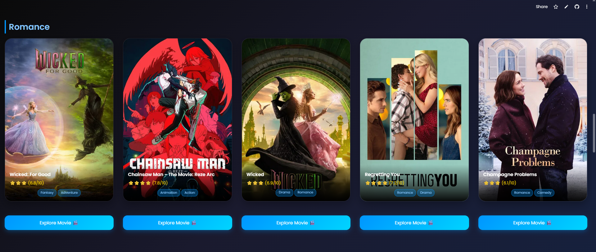
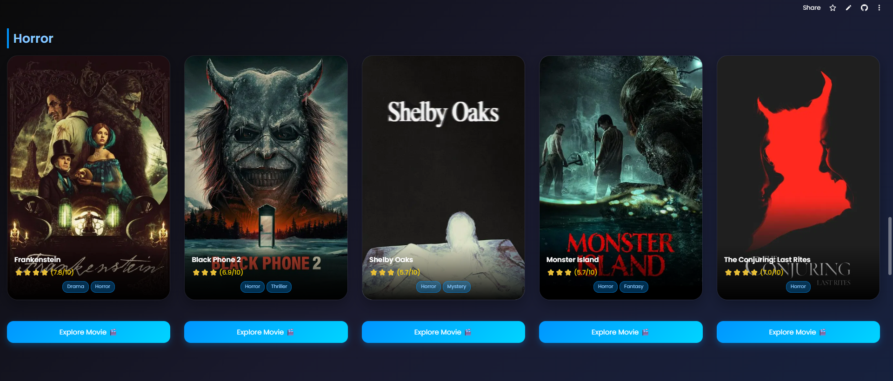
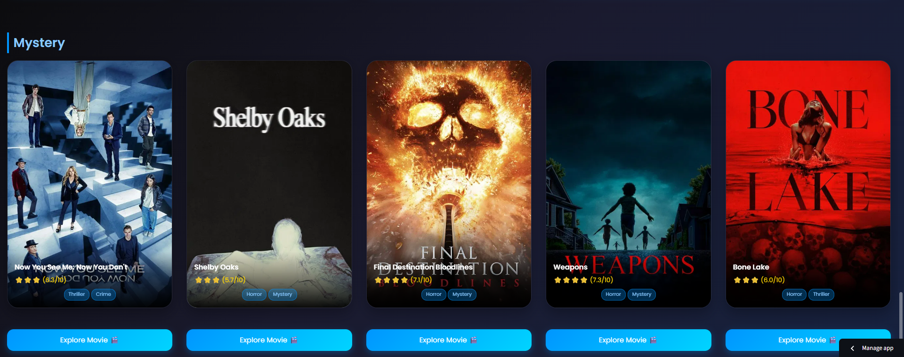

🎬 CINIVERSE – Movie Recommendation System
Your Gateway to Cinematic Excellence

1. Introduction 
CINIVERSE is a fully AI-powered Movie Recommendation System built using Python, Streamlit,
machine learning similarity algorithms, and the TMDb API. It provides personalized movie
recommendations, trending movies, genre-based exploration, and complete movie details including
cast, crew, and trailers. The system features a premium cinematic UI designed with custom CSS
animations, gradients, and responsive layouts.
2. Key Features 
• Smart movie recommendations using cosine similarity  • Trending movie section powered by TMDb
API  • Genre-wise movie exploration  • Full movie details with trailer, cast, crew  • Interactive, premium UI
with animations  • Mobile responsive and visually appealing design
3. System Architecture 
The architecture consists of a content-based filtering recommendation model combined with real-time
data from the TMDb API. The similarity engine uses vectorized metadata (tags, cast, crew, overview) to
compute cosine similarity scores and identify the closest matches.
4. User Interface Screenshots

   Screenshot 1:CINIVERSE system  This image shows the main homepage of the CINIVERSE system. It displays the title,
subtitle, and search interface for selecting movies from the dataset.

Screenshot 2:Movie Details Page  This screenshot displays the 'Smart Recommendations' section. When a user selects a
movie, the system previews the movie details before generating recommendations.

Screenshot 3:Smart Recommendations  This view shows the dynamic recommendation results, where the top 5 similar movies
are displayed using high-quality posters and rating overlays.

Screenshots:
The Trending Movies section is shown here, pulling real-time trending content from the
TMDb API and displaying movie cards with ratings and genres.
This screenshot captures genre-wise browsing. Users can explore movies under Action,
Drama, Mystery, Sci-Fi, and more with live API data.
A movie details page is shown here. It includes the poster, release date, rating, runtime,
genres, and production team information.
 The cast section is displayed in this screenshot. It includes actor images, actor names,
and character roles retrieved from TMDb API.
 This image shows the Synopsis section, a full-width block containing detailed storyline
information for the selected movie.
The trailer preview section is visible here, embedding official YouTube trailers inside the
CINIVERSE app.

  
  
  
  
  
  

Conclusion: 
Each screenshot demonstrates how CINIVERSE integrates machine learning, real-time API data, and
custom-built UI components to form a complete movie recommendation ecosystem. The system
provides a seamless, cinematic experience while delivering accurate and personalized results to users.
  

------------------------------------------------------------------------------------------------------------------------------------------------------------

📘 Project Description

CINIVERSE is an end-to-end Movie Recommendation System that uses:

Machine Learning (Cosine Similarity)

TMDb API (Posters, Cast, Crew, Trailers, Trending Movies)

Interactive Streamlit UI with premium styling

Content-based recommendation engine

Users can:

Search any movie

See similar movie recommendations

Explore trending movies

Browse by genre

View full movie details with trailer, cast, crew, and synopsis

 

------------------------------------------------------------------------------------------------------------------------------------------------------------

🏛 Architecture 
User Input → Search Movie → Fetch Movie Details → 
Similarity Model → Top 5 Recommendations → Display UI  

Trending Section → TMDb API → Movie Cards  

Genre Section → TMDb API + Local Dataset → Movie Cards  

Movie Details Page → Full TMDb Movie Data → Cast, Crew, Trailer  

------------------------------------------------------------------------------------------------------------------------------------------------------------

⚙️ Installation 
1️⃣ Clone repository
git clone https://github.com/Kumara5KN/CineVerseRecommender.git

cd ciniverse

2️⃣ Install dependencies
pip install -r requirements.txt

3️⃣ Add TMDb API Key

Create:

.streamlit/secrets.toml

Add:

TMDB_API_KEY="your_api_key_here"

4️⃣ Run
streamlit run app.py

------------------------------------------------------------------------------------------------------------------------------------------------------------

▶️ Usage

Open the app

Choose a movie

See details & recommendations

Browse trending movies

Explore genres

Watch trailer

------------------------------------------------------------------------------------------------------------------------------------------------------------

🌐 Deployment (Streamlit Cloud)
Steps:

Push code to GitHub

Go to https://cineverserecommender.streamlit.app

Select your repo

Add API key in Secrets

Deploy

